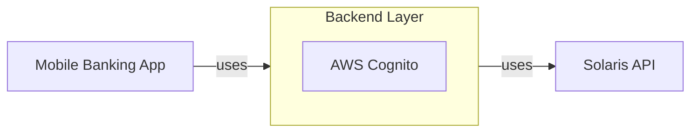

# Ivory Demo Application

A proof-of-concept mobile-banking application that uses [Solaris API](https://docs.solarisgroup.com/api-reference/).

## General architecture overview

The Mobile bank application is built with Flutter and can be deployed on both iOS and Android devices.

The Mobile application connects to a backend layer that connects to a [Solaris API](https://docs.solarisgroup.com/api-reference/). AWS Cognito is used on the backend middle layer to authenticate and differentiate users.



Environment variables can be set by copying `.env.example` to `.env` _(in root folder)_ and adding the values to the varibles.

## Scope

The application already includes the following features:

- Sign-up
- Email + password login
- User dashboard / landing page
- Transactions list
- Send money to a person
- Physical card details
- Filter & sort transactions
- Transaction details
- Search through transactions
- Physical card - deactivate
- Physical card - set card PIN
- Physical card - Freeze / Unfreeze

We are currently working on converting and developing the app into a revolving credit card app with features such as:

- Credit card onboarding
- Credit card operations (activate/deactivate, freeze/unfreeze, PIN change, viewing details, etc.)
- Credit card transactions (filtering, sorting, searching, upcoming transactions, etc.)
- Credit card payments (3DS, Apple wallet)
- Repayments

## Product prototype

<div align="center">
  <video src="https://github.com/ivoryio/SolarisDemoApp/assets/16954041/320f3f08-c1bf-4dc1-9523-38d5e44cb4b5" />
</div>

Find more details [here](https://www.thinslices.com/ivory-banking-app).

You can find the prototype [here](https://www.figma.com/proto/XReOTW8hCzSSTPsfqWhwy6/Ivory---Demo-App?page-id=1086%3A72864&type=design&node-id=1221-101377&viewport=-1964%2C1794%2C0.19&t=XEC1Fu5v6GR6h7B3-1&scaling=contain&starting-point-node-id=1221%3A101373).

## CI with Patrol

Automated integration tests run on GitHub Actions using [Patrol](https://patrol.leancode.co/).

### Platform Support

- **Android**: Runs on `ubuntu-latest` using `android-emulator-runner` action
  - Slower but reliable for smoke testing
  - Uses API level 31 (Android 12) by default
  
- **iOS**: Runs on `macos-14` using iOS Simulator
  - Faster execution with better performance
  - Uses iPhone 15 Pro simulator by default

### Required Secrets

For CI to run integration tests, configure these GitHub repository secrets:

- `PATROL_EMAIL` - Test account email for login tests
- `PATROL_PASSWORD` - Test account password for login tests

### Branch Triggers

CI runs automatically on:
- Pushes to `main` branch
- Pushes to feature branches matching `SOL-*` pattern
- Pull requests targeting these branches

**Note**: Update branch patterns in `.github/workflows/*.yml` if your branch naming differs.

### Environment Setup

Integration tests use two environment files:
1. **Main `.env`** (root) - App configuration (API URLs, Firebase, Cognito, etc.)
2. **Test `.patrol.env`** (integration_test/) - Test credentials only (EMAIL, PASSWORD)

The `.patrol.env` file is gitignored and created from `.patrol.env.example` during CI runs using repository secrets.

### Running Tests Locally

```bash
# Create test credentials file
cp integration_test/.patrol.env.example integration_test/.patrol.env

# Edit with your test account credentials
# Then run tests
patrol test integration_test/

# Or run specific test
patrol test integration_test/cardCanBeFrozenOrUnfreeze_test.dart
```

See `integration_test/ENV_SETUP.md` for detailed environment configuration.

## Contact

For any questions, guidance or other interests _(like building projects or getting hired)_ contact [Thinslices](https://www.thinslices.com/contact).
